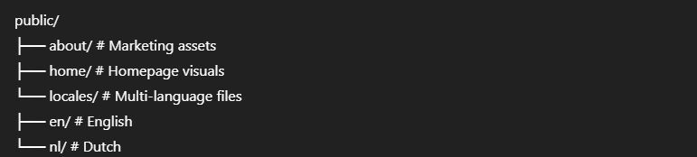
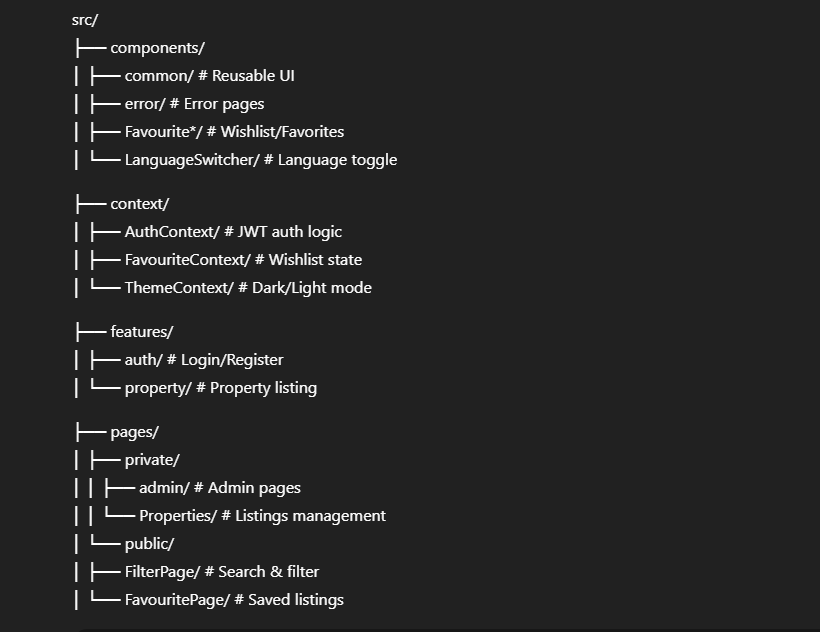

<!--

  

 -->

# 🚖 TAXILOG UK

> **Your ride, your way. Explore, book, and manage taxi rides & property listings across the UK.**

**TAXILOG UK** is a modern, full-stack platform designed to help users find rental properties and book taxi rides effortlessly. It features seamless authentication, role-based access, subscription payments, and a rich user/admin dashboard.

---

## 🌐 Live Demo

- 🔗 [Live Project](https://ornate-mousse-4779cd.netlify.app/)
- 📁 [GitHub Repository](https://github.com/shakilmonsi)

---

## 🛠️ Tech Stack

### 💻 Frontend

### 🧪 Backend

### 🔐 Authentication

### 💳 Payments

### 🚀 Deployment

---

## ✨ Features

### 🎉 General

- ⚡ Fast, responsive UI
- 💳 Stripe subscription support
- 🌍 EN/NL language toggle (i18next)
- 🔍 Browse and filter rental properties
- 🖼️ Property details with image gallery
- 💾 User dashboard with saved items

### 🔐 Auth & Roles

- JWT-based login/register
- Role-based access (Admin/User)

### 👤 User Dashboard

- Edit personal profile
- View booking history
- Add/remove favorites

### 👑 Admin Dashboard

- Admin profile management
- View & manage property history
- View users in table format

---

## 📂 Folder Structure

### `public/`

### `src/`

